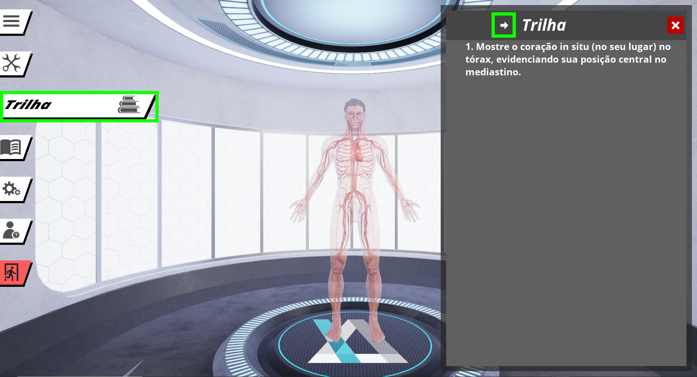
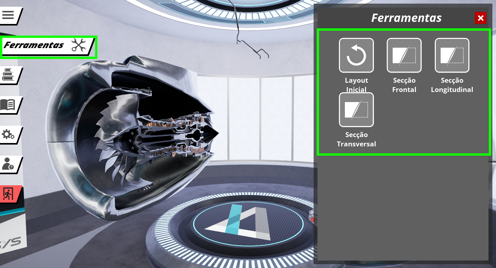

 
[labs-pc]: ./labs-pc.md

> Este guia tem o objetivo de auxiliar a utilização do **Simulador** na plataforma **PC**. O guia é primariamente destinado à **professores e coordenadores de instituições de ensino**.
 
## Requisitos Técnicos
 
 
A seguir são listados os requisitos técnicos necessários para realizar a instalação  dos **Simuladores**:
 
1. Uma máquina com sistema operacional **Windows 10**
1. O **aplicativo do Simulador instalado** na máquina (Veja o [guia de instalação do Simuladores no PC][labs-pc])
1. O **Informações de login** (fornecida pela Imersys por e-mail)
 
## Guia de Utilização
 
 
### 1º Passo: Acessando as Aulas
 
Após fornecer as **Informações de login** é possível explorar as experiências disponíveis do **Simulador**. Selecione a opção **Aulas** no menu lateral e então selecione uma aula para explorar na caixa de opções à direita.
 

 
### 2º Passo: Iniciando as Trilhas
 
Em **Aulas**, existem roteiros para guiar o professor pelo conteúdo. Para acessar esse roteiro, basta apenas selecionar o menu lateral em **Trilha**, e navegar com as setas no menu de diálogo da direita.
 

 
>**Trilhas** vão demonstrar o conteúdo de uma maneira interativa. É esperado que além de navegar, o usuário leia o conteúdo na trilha e interaja com o conteúdo no ambiente virtual do **Simulador**.
 
### 3º Passo: Explorando o Ambiente
 
Cada **Aula** pode oferecer uma diversidade de ferramentas para melhor observar o conteúdo. O usuário é encorajado a explorar o ambiente também livremente. Use as **ferramentas** e explore a aba de **conteúdo** dentro de uma aula.

> Caso o usuário tenha problemas com a exploração do **Simulador**, a opção do **Tutorial** no menu lateral irá auxiliá-lo explicando as mecânicas de interatividade encontradas dentro do aplicativo.