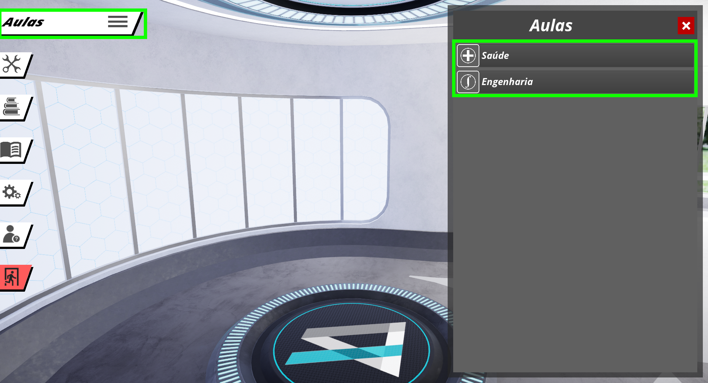

 
> Este guia tem o objetivo de auxiliar a utilização do **Simulador** na plataforma **PC**. O guia é primariamente destinado à **professores e coordenadores de instituições de ensino**.
 
## Requisitos Técnicos
 
 
A seguir são listados os requisitos técnicos necessários para realizar a instalação  dos **Simulador**:
 
1. Sistema operacional compatível **Windows 10**
2. A **Arquivo para instalação** (fornecido pela Imersys)
3. O **Simulador instalado na máquina** (Veja o guia de instalação do simulador)
3. A **Cadastro para login** (fornecida pela Imersys por e-mail)
 
## Guia de Utilização
 
 
### 1º Passo: Acessando as Experiências
 
Após fornecer o Cadastro na tela de login, é possível explorar as experiências disponíveis do **Simulador**. Selecione a opção **Aulas** no menu lateral e então selecione uma aula para explorar no **Simulador** na caixa de opções à direita.
 

 
### 2º Passo: Iniciando Experiências Guiadas às Experiências
 
Em aulas, existem roteiros para guiar o professor e pelo conteúdo. Para acessar esse roteiro, basta apenas selecionar o menu lateral em **Trilha**, e navegar com as setas no menu de diálogo da direita.
 

 
>**Trilhas** vão demonstrar o conteúdo de uma maneira interativa. É esperado que além de navegar o usuário leia o conteúdo na trilha e interaja com o conteúdo no ambiente virtual do **Simulador**.
 
### 3º Passo: Explorando o Ambiente
 
Cada Aula pode oferecer uma diversidade de ferramentas para melhor observar o conteúdo. O usuário é encorajado a explorar o ambiente também livremente. Use as **ferramentas** e explore a aba de **conteúdo** dentro de uma aula.

> Se hover problemas com a exploração do **Simulador**, exite o **Tutorial** dentro da aplicação que explica as mecânicas que são encontradas nas aulas.