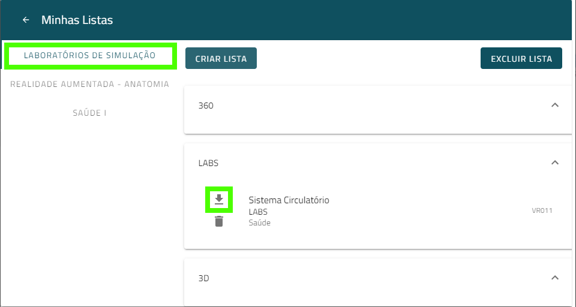

> Este guia tem o objetivo de auxiliar a instalação do **Ambia Labs** na plataforma **PC**. O guia é primariamente estinado à **administradores de sistemas**.

## Requisitos técnicos

A seguir são listados os requisitos técnicos para realizar a instalação do **Simulador**

1. **Informações de login** para o [catálogo] [https://catalogo.imersys.com] (Fornecido via email pela Imersys)
2. Uma máquina com sistema operacional **Windows 10**
3. **2GB** de espaço disponível para instalação

## Guia de instalação

### 1º Passo: Acessando o Catálogo

Para encontrar o **Instalador** do **Simulador** é necessário que o usuário vá ao [catálogo][https://catalogo.imersys.com/home] da Imersys e entre com as informações de login. 

### 2º Passo: Navegando pelas experiências de Simuladores

Em seguida o usuário deve selecionar **Laboratórios de Simulação** para escolher as experiências que deseja usar no Simulador.

Aqui os usuários tem uma diversidade de **Laboratórios de Simulação** para escolher. Nessa etapa o usuário pode escolher apenas as experiências que ele deseja baixar. Basta selecioná-las no botão com ícone **+**.

Em seguida o usuário escolhe qual lista o laboratório de simulação ficará. O usuário também pode criar novas listas facilitar a organização.

### 3º Passo: Baixando o **Instalador** do **Simulador**

Para baixar o instalador o usuário deve, no campo superior direito da tela, selecionar o seu perfil e clicar em **Minhas Listas**.

O usuário deve selecionar em seguida a **Lista** na qual os **Laboratórios de Simulação** foram adicionados. Para baixar, basta clicar no ícone de download.

### 4º Passo: Instalando o **Simulador**

Uma janela no navegador irá aparecer com a opção de abrir o **instalador de aplicativo**. O usuário deverá então abrir o instalador com essa janela.

Uma janela com as opções de instalação surge, na qual o usuário deve iniciar a instalação. Após iniciar a instalação o usuário deve esperar o download terminar.

>E assim foi concluída a instalação do **Simulador** na máquina. Agora basta apenas abrir o programa.

## Testando a instalação

Para testar o **Simulador**, o usuário deve executar, na sua máquina, o aplicativo AmbiaVR. Ao iniciar, o usuário terá que entrar com as **informações de login**.

Ao iniciar, o AmbiaVR irá procurar por atualizações, basta esperar e o usuário agora pode explorar os **Laboratórios de Simulação** a vontade.

## Eventuais problemas

### Habilitando instalação de aplicativos de terceiros no Windows
Em versões não atualizadas do Windows, é possível a instalação ser bloqueada pelo sistema operacional por razão de ser de um aplicativo de fora da Microsoft Store por padrão.Essa Exceção ocorreu na versão 1903 do Windows 10 e possivelmente também pode ocorrer em versões anteriores. Nesse caso o usuário precisa habilitar o *sideload* de Apps nas configurações. Se esse for o caso, basta clicar em **habilitar o modo sideload de Apps** na janela com o erro de falha na instalação. O Windows abrirá uma janela pedindo confirmação se o usuário pretende abrir as configurações. Nas configurações o usuário deve selecionar **sideload de Apps**.

Após habilitar o modo de **sideload de Apps** nas configurações o usuário deve tentar baixar novamente o instalador.
