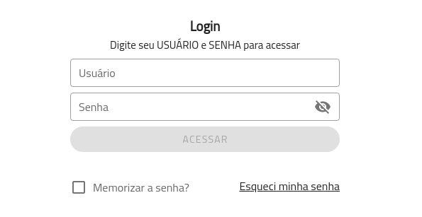
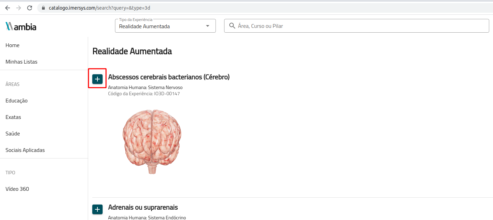
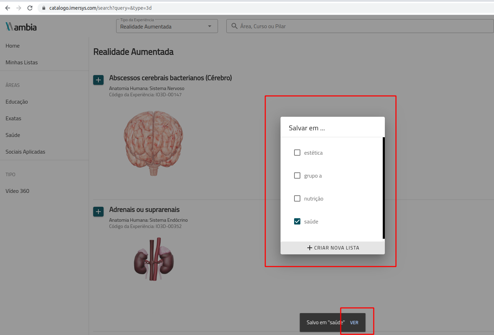

> Este guia é primariamente destinado à **professores e coordenadores de instituições de ensino**.

## Um Catálogo de Experiências Imersivas!

O [catálogo Ambia](https://catalogo.imersys.com/) é um acervo completo de experiências de Vídeos 360, Objetos de Aprendizagem 3D e Simuladores de laboratórios. Destinado a professores e coordenadores de cursos que desejam pesquisar experiências imersivas a serem utilizadas em suas aulas e Unidades de Aprendizagem.

### Efetuando o login

Para acessar o catálogo é necessário uma conta com usuário e senha **fornecida pela sua instituição de ensino**.

Se você já possui o usuário e a senha, prossiga efetuando o login. Caso contrário, entre em contato com sua instituição - possivelmente ela já obteve este código previamente junto à Imersys.

### Utilizando o Catálogo

Utilize a barra lateral do **catálogo** para filtrar pelas grandes áreas ou então a barra de pesquisa superior para pesquisar textualmente por vídeos, 3Ds ou simuladores. Após encontrar a experiência desejada, clique no ícone lateral como mostrado na imagem abaixo.

Ao clicar no ícone, uma janela será aberta e você poderá salvar a experiência numa lista. Ao clicar em **"VER"**, você irá até a página das listas e lá poderá compartilhar a experiência para utilizar no *LMS* ou outro aplicativo de sua instituição.

